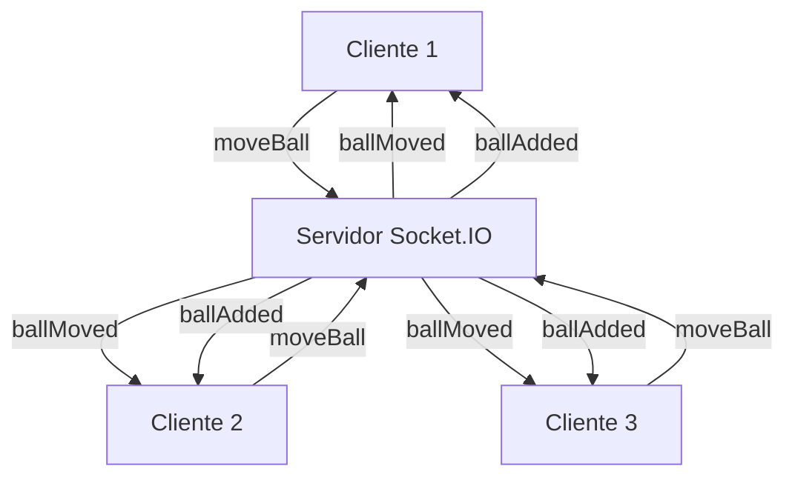

# 🎮 WebSocket Multiplayer Game - Bolinhas Interativas

Um projeto full-stack minimalista para demonstrar comunicação em tempo real usando **WebSockets** com **Socket.IO**, implementando um jogo multiplayer onde múltiplos usuários controlam bolinhas coloridas em uma canvas compartilhada.

## 🏗️ Arquitetura do Projeto

### **Padrão Frontend/Backend Separado**

Este projeto segue o padrão de **arquitetura separada** entre frontend e backend, oferecendo:

- **🔧 Flexibilidade**: Cada parte pode ser desenvolvida, testada e deployada independentemente
- **📈 Escalabilidade**: Backend pode ser escalado horizontalmente sem afetar o frontend
- **🔄 Reutilização**: Backend pode servir múltiplos frontends (web, mobile, desktop)
- **👥 Equipes**: Diferentes equipes podem trabalhar em frontend e backend simultaneamente

### **Stack Tecnológica**

#### **Frontend (Cliente)**
- **Next.js 14** - Framework React com App Router
- **TypeScript** - Tipagem estática para maior segurança
- **Tailwind CSS** - Framework CSS utilitário
- **Socket.IO Client** - Cliente WebSocket para comunicação em tempo real
- **React Hooks** - Gerenciamento de estado e efeitos colaterais

#### **Backend (Servidor)**
- **Node.js** - Runtime JavaScript server-side
- **Express.js** - Framework web minimalista
- **Socket.IO** - Biblioteca WebSocket com fallbacks automáticos
- **CORS** - Middleware para requisições cross-origin

## 🎯 Conceitos Implementados

### **1. Comunicação em Tempo Real**
- **WebSockets**: Conexão bidirecional persistente entre cliente e servidor
- **Socket.IO**: Abstração que oferece fallbacks para HTTP long-polling
- **Eventos customizados**: Sistema de eventos para diferentes ações do jogo

### **2. Estado Compartilhado**
- **Estado global**: Servidor mantém estado de todas as bolinhas em memória
- **Sincronização**: Mudanças são propagadas para todos os clientes conectados
- **Consistência**: Servidor é a fonte única da verdade

### **3. Componentização React**
- **Componentes reutilizáveis**: Cada parte da UI é um componente isolado
- **Hooks customizados**: Lógica de negócio separada da apresentação
- **Props tipadas**: TypeScript garante contratos entre componentes

### **4. Padrões de Design**

#### **Separation of Concerns**
```
📁 client/          # Interface do usuário
├── components/     # Componentes React reutilizáveis
├── hooks/          # Lógica de negócio customizada
└── app/           # Páginas e layouts

📁 server/          # Lógica de servidor
└── server.js      # Servidor Socket.IO
```

#### **Event-Driven Architecture**
- **Cliente → Servidor**: `moveBall`, `disconnect`
- **Servidor → Cliente**: `ballAssigned`, `ballMoved`, `ballAdded`, `ballRemoved`

## 🎮 Funcionalidades

### **Controles Multiplataforma**
- **🖥️ Desktop**: WASD, setas do teclado, clique do mouse
- **📱 Mobile**: Joystick virtual, touch para teleporte
- **🔄 Tempo Real**: Movimentos sincronizados entre todos os clientes

### **Sistema de Bolinhas**
- **🎨 Cores únicas**: Cada jogador recebe uma cor diferente
- **🆔 IDs sequenciais**: Identificação única para cada bolinha
- **📍 Posicionamento**: Coordenadas precisas com validação de bordas
- **⚡ Movimento fluido**: 60fps com interpolação suave

### **Canvas Interativa**
- **📐 Dimensões fixas**: 300x300px para consistência
- **🎯 Área clicável**: Teleporte instantâneo para posição clicada
- **🔲 Bordas visíveis**: Limites claros da área de jogo
- **📊 Debug integrado**: Logs detalhados no console

## 🚀 Como Executar

### **Pré-requisitos**
- Node.js 18+ 
- npm ou yarn

### **Instalação**
```bash
# Clonar o repositório
git clone <repo-url>
cd websocket-game

# Instalar dependências do servidor
cd server
npm install

# Instalar dependências do cliente
cd ../client
npm install
```

### **Execução**
```bash
# Terminal 1 - Servidor (porta 3001)
cd server
npm run dev

# Terminal 2 - Cliente (porta 3000)
cd client
npm run dev
```

### **Acesso**
- **Frontend**: http://localhost:3000
- **Backend**: http://localhost:3001

## 🔧 Padrões de Código

### **Convenções de Nomenclatura**

#### **Arquivos e Pastas (kebab-case)**
```
✅ Correto:
- virtual-joystick.tsx
- game-canvas.tsx
- use-socket-connection.ts
- ball-component.tsx

❌ Incorreto:
- VirtualJoystick.tsx
- GameCanvas.tsx
- useSocketConnection.ts
```

#### **Componentes React (PascalCase)**
```typescript
// ✅ Correto
export default function VirtualJoystick() { }
export default function GameCanvas() { }

// ❌ Incorreto
export default function virtual-joystick() { }
```

#### **Hooks (camelCase com prefixo 'use')**
```typescript
// ✅ Correto
export function useSocketConnection() { }
export function useMovement() { }

// ❌ Incorreto
export function use-socket-connection() { }
```

#### **Props e Estados (camelCase)**
```typescript
// ✅ Correto
const [isConnected, setIsConnected] = useState(false)
const handleJoystickMove = (position: { x: number; y: number }) => { }

// ❌ Incorreto
const [is-connected, setIsConnected] = useState(false)
const handle-joystick-move = (position: { x: number; y: number }) => { }
```

### **Estrutura de Componentes**

#### **Template Padrão**
```typescript
'use client'

import { useState, useCallback } from 'react'

interface ComponentProps {
  // Props tipadas
  onAction: (data: any) => void
  className?: string
}

export default function ComponentName({ 
  onAction, 
  className = "" 
}: ComponentProps) {
  // Estados locais
  const [state, setState] = useState(initialValue)
  
  // Handlers
  const handleAction = useCallback((event: Event) => {
    // Lógica do handler
    onAction(data)
  }, [onAction])
  
  // Render
  return (
    <div className={`base-classes ${className}`}>
      {/* Conteúdo do componente */}
    </div>
  )
}
```

### **Estrutura de Hooks**

#### **Template Padrão**
```typescript
import { useState, useEffect, useCallback } from 'react'

interface HookReturn {
  // Estados e funções expostas
  data: any
  isLoading: boolean
  handleAction: () => void
}

export function useCustomHook(): HookReturn {
  // Estados internos
  const [data, setData] = useState(null)
  const [isLoading, setIsLoading] = useState(false)
  
  // Funções internas
  const handleAction = useCallback(() => {
    // Lógica da função
  }, [])
  
  // Efeitos
  useEffect(() => {
    // Lógica do efeito
    return () => {
      // Cleanup
    }
  }, [])
  
  // Retorno
  return {
    data,
    isLoading,
    handleAction
  }
}
```

## 📡 Eventos Socket.IO

### **Cliente → Servidor**
| Evento | Payload | Descrição |
|--------|---------|-----------|
| `moveBall` | `{ ballId, x, y }` | Move bolinha para nova posição |
| `disconnect` | - | Cliente desconectou |

### **Servidor → Cliente**
| Evento | Payload | Descrição |
|--------|---------|-----------|
| `ballAssigned` | `{ ballId, color }` | Nova bolinha atribuída ao cliente |
| `initialBalls` | `Record<number, Ball>` | Estado inicial de todas as bolinhas |
| `ballAdded` | `Ball` | Nova bolinha adicionada ao jogo |
| `ballMoved` | `{ ballId, x, y }` | Bolinha foi movida |
| `ballRemoved` | `number` | Bolinha foi removida (cliente desconectou) |

## 🎨 Componentes do Sistema

### **VirtualJoystick**
- **Propósito**: Controle de movimento para dispositivos móveis
- **Props**: `onJoystickMove`, `onJoystickStart`, `onJoystickEnd`, `className`
- **Funcionalidades**: Drag and drop, limites circulares, retorno ao centro

### **GameCanvas**
- **Propósito**: Área de jogo principal com renderização de bolinhas
- **Props**: `balls`, `myBallId`, `onCanvasClick`, `width`, `height`
- **Funcionalidades**: Renderização de bolinhas, clique para teleporte

### **Ball**
- **Propósito**: Renderização individual de uma bolinha
- **Props**: `id`, `x`, `y`, `color`, `isMyBall`
- **Funcionalidades**: Estilização condicional, animações

## 🔄 Fluxo de Dados



## 🚀 Próximos Passos

### **Melhorias Possíveis**
- **🗄️ Persistência**: Banco de dados para salvar estado
- **🔐 Autenticação**: Sistema de login/registro
- **🏠 Salas**: Múltiplas salas de jogo
- **💬 Chat**: Comunicação entre jogadores
- **🎨 Customização**: Temas e skins personalizáveis
- **📊 Analytics**: Métricas de uso e performance
- **🌐 Deploy**: Hospedagem em produção

### **Arquiteturas Avançadas**
- **Microserviços**: Separar lógica de jogo, chat, autenticação
- **Load Balancing**: Múltiplas instâncias do servidor
- **Redis**: Cache distribuído para estado compartilhado
- **Docker**: Containerização para deploy consistente

## 📚 Recursos de Aprendizado

- [Socket.IO Documentation](https://socket.io/docs/)
- [Next.js App Router](https://nextjs.org/docs/app)
- [React Hooks](https://react.dev/reference/react)
- [TypeScript Handbook](https://www.typescriptlang.org/docs/)
- [WebSocket Protocol](https://tools.ietf.org/html/rfc6455)

---

**Desenvolvido para demonstração de conceitos de WebSocket e arquitetura full-stack** 🚀# websocket-interaction

